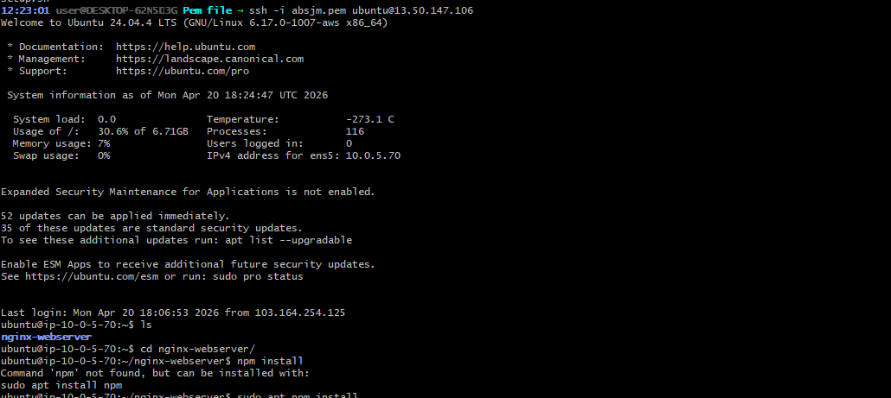
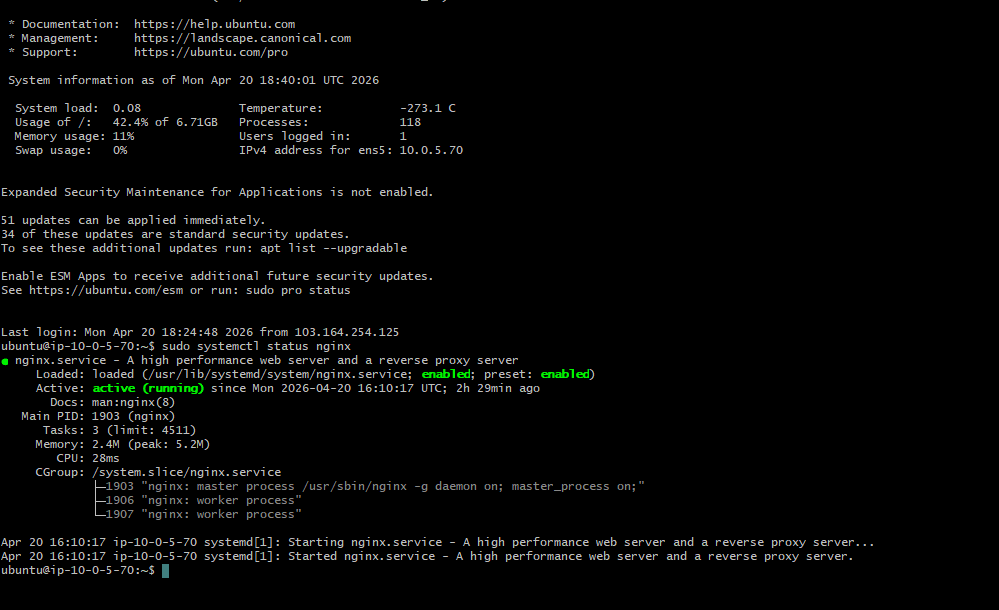
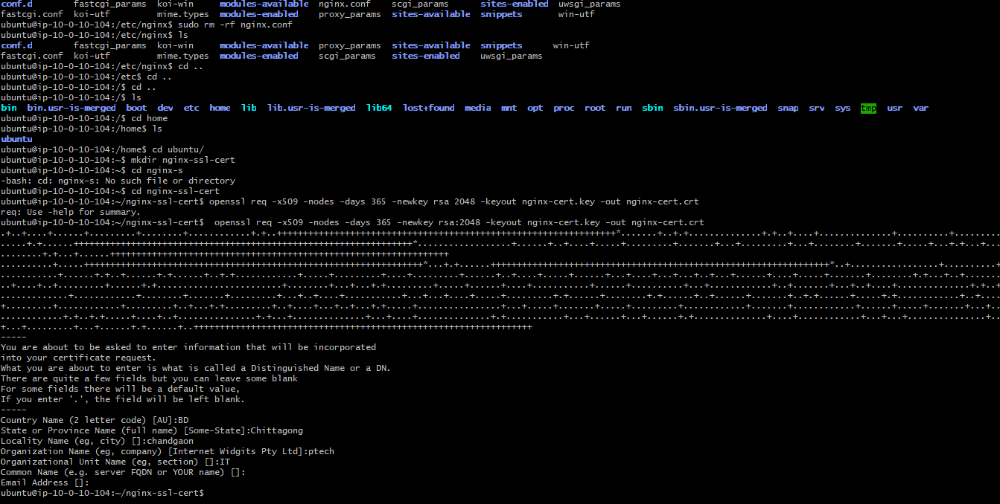
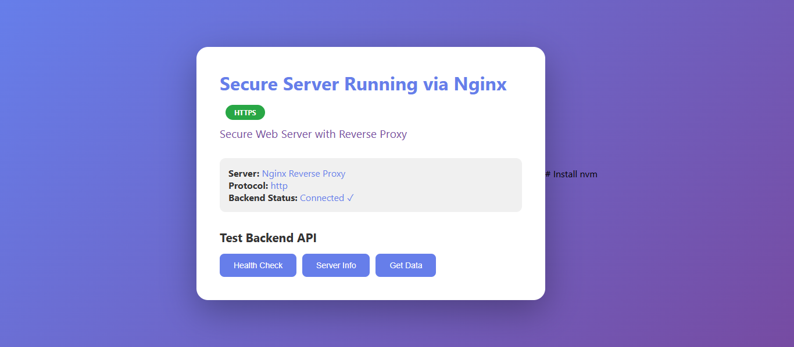
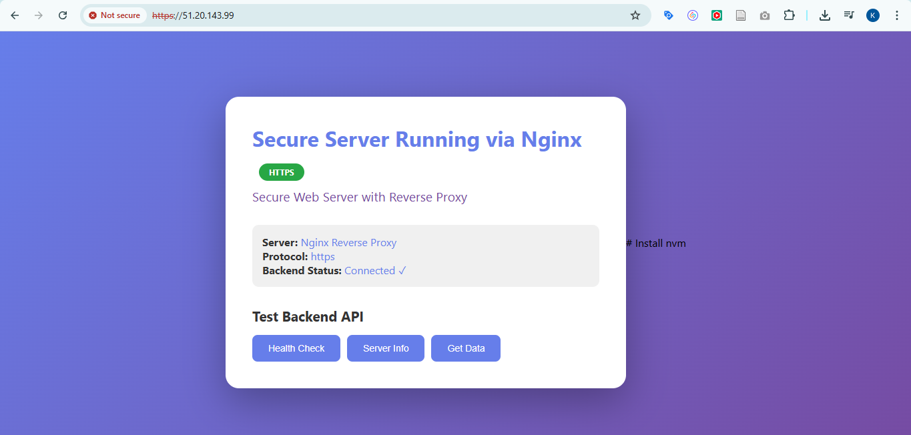
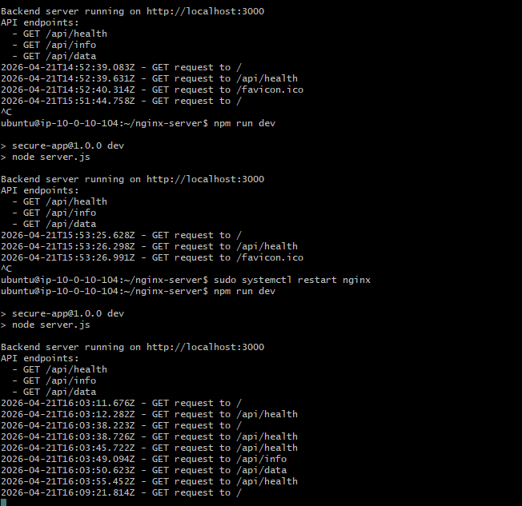

# ⚙️ Step-by-Step Setup

## 🔹 1. Launch AWS EC2 Instance

Use Ubuntu 22.04

Configure Security Group:
- Port 22 (SSH)
- Port 80 (HTTP)
- Port 443 (HTTPS)

Connect to EC2:
```bash
ssh -i your-key.pem ubuntu@your-ec2-public-ip
```

## 🔹 2. Install Required Packages

```bash
sudo apt update
sudo apt install nginx openssl -y
```

Verify installation:
```bash
nginx -v
```

## 🔹 3. Setup Backend (Node.js)

```bash
cd /home/ubuntu
mkdir nginx-server
cd nginx-server
npm init -y
npm install express
```

Create server.js:
```javascript
const express = require("express");
const app = express();

app.get("/", (req, res) => {
  res.send("Backend Running via Nginx Reverse Proxy 🚀");
});

app.listen(3000, () => {
  console.log("Server running on port 3000");
});
```

Run the server:
```bash
node server.js
```

## 🔹 4. Generate SSL Certificate

```bash

ubuntu@ip-10-0-10-104:/home$ cd ubuntu/
ubuntu@ip-10-0-10-104:~$ mkdir nginx-ssl-cert
ubuntu@ip-10-0-10-104:~$ cd nginx-s
-bash: cd: nginx-s: No such file or directory
ubuntu@ip-10-0-10-104:~$ cd nginx-ssl-cert


openssl req -x509 -nodes -days 365 -newkey rsa 2048 -keyout nginx-cert.key -out nginx-cert.crt

```

Fill in details:
- Common Name → your EC2 public IP

## 🔹 5. Configure Nginx

```bash
ubuntu@ip-10-0-10-104:~/nginx-server/configs$ sudo nano nginx.conf

```

Paste the following configuration:

```nginx
# HTTP → HTTPS redirect
# how many worker should run
worker_proesses 1

events {
    worker_connections 1024;

}


http {
    include mime.types;
   
    # upstream 
    upsrtream nodejs_cluster{
        server 127.0.0.1:3000;

    }
    server{
        listen 443 ssl;
        server_name localhost;

        # ssl certificate path id
        ssl_certificate /home/ubuntu/nginx-ssl-cert/nginx-cert.crt;
        ssl_certificate_key /home/ubuntu/nginx-ssl-cert/nginx-cert.key;

        # server location
        location / {
            proxy_pass http://nodejs_cluster;
            proxy_set_header Host $host;
            proxy_set_header X-Real_IP $remote_addr;
            # proxy_set_header X-Forwarded-For $proxy_add_x_forwarded_for;
        }

    }

    server {
        listen 80;
        server_name localhost;

        # rdiect
        location / {
            return 301 https://$host$request_uri;
        }   
    }
}
```

## 🔹 6. Test and Reload Nginx

```bash
sudo nginx -t
sudo systemctl reload nginx
```

---

# 🧪 Testing & Verification

## ✅ 1. HTTP → HTTPS Redirect

Visit:
```
http://your-ec2-ip
```

✔ Automatically redirects to:
```
https://your-ec2-ip
```

## ✅ 2. HTTPS Working

Browser may show "Not Secure" warning (self-signed SSL)
Click Advanced → Proceed

✔ Page displays:
```
Secure Server Running via Nginx
```

## ✅ 3. Backend via Reverse Proxy

Visit:
```
https://your-ec2-ip/api/
```

✔ Output:
```
Backend Running via Nginx Reverse Proxy 🚀
```

---

# 📸 Required Screenshots


## Screenshot 1: EC2 Connection


## Screenshot 2: nginx Status 


## Screenshot 3: SSL Certificate


## Screenshot 4: HTTP 


## Screenshot 5: HTTPS page loaded with redirect


## Screenshot 6: Backend response via /api/


